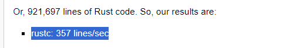

# 100 SANİYEDE GOLANG

GO, Google tarafından 2007 yılında geliştirilmeye başlanmış,
yüksek seviyeli basitliği alçak seviyeli hızlara yaklaştıran
bir programlama dilidir.

Günümüzde c# ve c++’ın ardından
dünyanın en çok kullanılan 7. programlama dili olmakla birlikte
makina koduna derlenen bir dil olduğu için genel olarak
Python gibi interpreted dillerden neredeyse 40 kat daha hızlıdır.


C/C++ gibi belleği kendiniz idare etmeniz gerektiği dillerin aksine,
Go, garbage collection kullanarak bu sorumluluğu üstünüzden almaktadır.
Garbage collection ile birlikte,
Go hız olarak Rust ve C++ gibi sistem dillerinin gerisinde kalsada
derlenme hızı açısından en hızlı dillerden biridir.



Go kodu yazmaya başlamak için sitelerinden “installer”’ı
indirin ve kurulumu tamamladıktan sonra sonu .go ile biten bir dosya oluşturun.

Dosyanın en başına ise “package” kelimesini kullanarak bir paket oluşturun.

```go
package main
```

Go, modülleri paketlere ayırarak bazı dillerde
oldukça zaman alan import export gibi modül işlemlerini basitleştirmektedir.

Ardından programımızın çalışmaya başlayacağı 
main fonksiyonunu oluşturun ve println fonksiyonunu
çağırarak ekrana birşeyler yazdırın.

```go
package main

func main() {
  println("Abone olur musun?")
}
```

Ardından, terminalinizde `go run` komutunu çalıştırın ve kodunuzun çalışmasını izleyin.
Dilerseniz de `go build` komutunu çalıştırın ve programınızı tek bir `.exe` dosyasına dönüştürün.

```bash
$  go run main.go

# veya

$ go build main.go
```

Bir değişken oluşturmak için var kelimesini kullanın ve ardından
değişkenin ismini ve tipini belirleyin.

```go
var abone bool = true
```

Ya da var kelimesini ve tipini atın ve eşittir işaretini arkasına
bir iki nokta işareti yerleştirin. Go değişkenin tipini sizin için tanıyacaktır.

```go
abone := true
```

Go bunun yanında her dilde bekleyeceğiniz birçok özelliği sizlere sunsada
aslında en başarılı olduğu konulardan birisi concurrency yani eş zamanlılıktır.

Go ile eş zamanlılık, bir fonksiyonun başına `go` yazmak kadar basit. Şaka yapmıyorum.

Bir fonksiyon oluşturacağım, tek bir argüman alacak ve bu argümanı 500 milisaniye aralıklarla konsola yazdıracak.

```go
package main

import (
  "fmt"
  "time"
)

func yazdir(metin string) {
  for {
    fmt.Println(metin)
    time.Sleep(500 * time.Millisecond)
  }
}
```

Ardından bu fonksiyonu çağırmak istediğimde başına `go` yazacağım ve fonksiyon başka bir thread'de çalışmaya başlayacak. Bunun ardından dil, başına `go` yazılan fonksiyonu arka planda çalıştıracak ve programın akışını kesmeden diğer kodları çalıştıracaktır.

```go
func main() {
  go yazdir("Abone olur musun?")
  yazdir("Like atar mısın?")
}
```

Bu ve bundan sonraki bütün videolarımın metinlerini, kaynakçalarını ve kod örneklerini githubda açık kaynak lisanslı bir projenin dahilinde bulabilirsiniz.

İzlediğiniz için teşekkürler, görüşmek üzere.

# Kaynakça

[Go Documentations](https://go.dev/doc/),
[Go vs Python](https://oxylabs.io/blog/go-vs-python#:~:text=Clear%20and%20easy%20readability.,commonly%20used%20in%20container%20technologies.),
[LanguageCompilationSpeed](https://wiki.alopex.li/LanguageCompilationSpeed)
