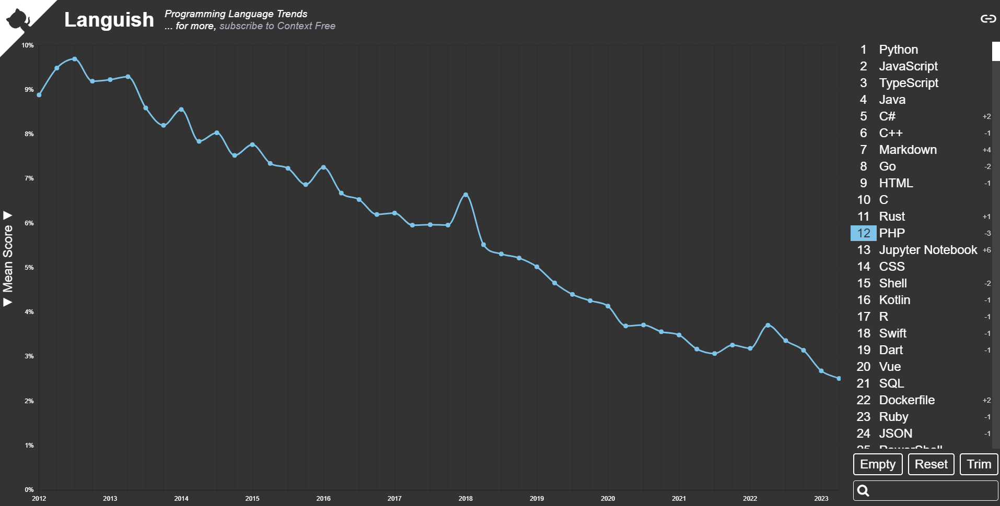
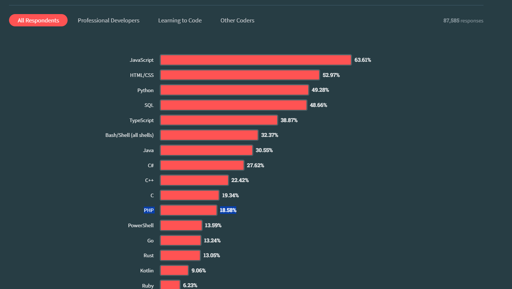

# 100 Saniyede PHP

Php, 1994 yılında Rasmus Lerdorf tarafından geliştirilen, sunucu taraflı, genel amaçlı bir programlama dilidir. Php Popülerliğinin zirvesine 2012 yılında ulaşmış ve günümüzde github ve stackoverflow verilerine göre dünyanın en çok kullanılan 12., stackoverflow 2023 geliştirici anketine göre ise de %18 ile en çok geliştiricinin bildiği 11. programlama dilidir.




Günümüzde PHP; Wordpress, Facebook, Wikipedia, Slack, Tumblr gibi bir çok site tarafından kullanılmaktadır.

Php, html'in içine embed edilen ilk dillerden biridir. Yani php kodu yazmaya başlamak için sonu nokta php ile biten bir dosya oluşturun ve içinde php tagını açarak kodlarınızı yazmaya başlayın.

Echo kelimesi ile ekrana bir şeyler yazdırabilirsiniz.

Php'nin söz dizimi bazılarınızın tanıyor olabileceği `perl` programlama dilinden esimlenmiştir.

```php
<html>
  <body>
    <?php
      echo "Merhaba Dünya!";
    ?>
  </body>
</html>
```

Bir değişken oluşturmak için $ işaretini kullanın ve ardından değişkeninizin ismini yazın.

```php
<?php
  $isim = "Reshy!";
  echo $isim;
?>
```

Php, dinamik bir dil olduğu için değişkenlerin tiplerini belirtmenize gerek yoktur. Fakat modern php ile tipler belirtmek için type hinting kullanılabilir.

```php
<?php
  function selam(string $isim) {
    echo "merhaba ", $isim;
  }
?>
```

Php, her dilde bekleyeceğiniz modern özelliklerin çoğunu bulundurmaktadır.

Örneğin bir koşul ifadesi oluşturmak için if ve else kelimelerini,

```php
<?php
  $sayi = 5;
  if ($sayi > 10) {
    echo "Sayı 10'dan büyük";
  } else {
    echo "Sayı 10'dan küçük";
  }
?>
```

Bir döngü oluşturmak için for ve while kelimelerini,

```php
<?php
  for ($i = 0; $i < 10; $i++) {
    echo $i;
  }
?>
```

```php
<?php
  $sayi = 0;
  while ($sayi < 10) {
    echo $sayi;
    $sayi++;
  }
?>
```

Switch tipinde bir koşul ifadesi oluşturmak için switch kelimesini kullanabilirsiniz.

```php
<?php
  $uye = false;
  switch ($uye) {
    case false:
      echo "Seni discord sunucumuza bekliyoruz :D";
      break;
    case true:
      echo "Aramıza katıldığın için teşekkürler.";
      break;
    default:
      echo "default";
  }
?>
```

Php 8 ile birlikte, Rust'a benzer bir match ifadesi de dilin içine eklenmiştir.

```php
<?php
$uye = false;
match ($uye) {
  false => echo "Seni discord sunucumuza bekliyoruz :D";
  true => echo "Aramıza katıldığın için teşekkürler.";
  default => echo "default";
}
```

Her ne kadar html'in içinde php yazmak çok zevkli olsada bu gün yeni bir projeye başlayacak olursanız büyük ihtimalle html'in içinde php kodu yazmak yerine Laravel gibi modern bir framework kullanıyor olacaksınız.

Bu videoyu sizlere biraz motivasyon vererek bitirmek istiyorum,
Php, 2012 yılından beri düşüşte olmasına ve bir çok kişi tarafından dünyanın en kötü programlama dillerinden birisi olarak anılmasına rağmen yılmamış, çalışmış ve günümüzde bir çok modern özelliğe sahip olan ve kullanan geliştiricilerin sevdiği bir dil haline gelmiştir.

O yüzden sizlerde, hedeflerinizi bırakmayın ve çalışmaya devam edin.

Görüşmek üzere.

# Kaynakça

- [Stackoverflow geliştirici anket](https://survey.stackoverflow.co/2023/)
- [Languish](https://tjpalmer.github.io/languish/)

Special thanks to [Fireship](https://www.youtube.com/@Fireship) as always.
