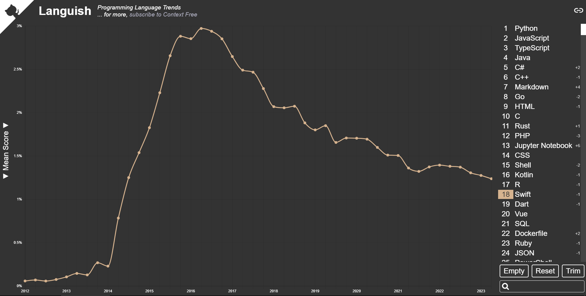

# 100 Saniyede Swift

Swift 2014 yılında Apple tarafından Objective-C'nin yerini alması için geliştirilmiş günümüzde Apple'ın ekosisteminde kilitli kalan uygulamalar yapmak için kullanılan bir programlama dilidir.

Stackoverflow ve Github verilerine göre dünyanın en popüler 18, Stackoverflow 2023 geliştirici anketine göre ise de en çok geliştirici tarafından kullanılan 20. programlama dilidir.



Swift, iOS için mobil uygulamaları, MacOS için masaüstü uygulamaları ve kısacası Apple ekosistemindeki neredeyse herşeyi yapmak için kullanılabilir.

Apple tarafından yapılmış olsa da açık kaynaklı bir dildir ve sanılanın aksine interpreted değil compiled yani makina koduna dönüşen bir dildir.

Bu sayede Swift, sanılanın aksine oldukça hızlı bir dildir. 

Swift kodu yazmaya başlamak için evinize en yakın Apple mağazısına girin ve karşınıza çıkan en pahalı Macbook'u satın alın. Ardından apple ekosisteminden çıkmadığımıza emin olmak için hali hazırda var olan kod editörünüzü çöpe atın ve yerine xCode indirin.

Tabiki şaka yapıyorum, sitesine girin ve kullandığınız işletim sistemi için Swift'i indirin ve ardından en sevdiğiniz kod editöründe sonu .swift ile biten bir dosya oluşturun.

Eğer benim gibi Windows kullanıyorsanız ve Swift kurmayı başaramadıysanız büyük ihtimalle Swift for windows gibi bir projeyi kullanmanız gerekecektir.

Ekrana bir çıktı yazdırmak için print fonksiyonunu,

```swift
print("Hello World")
```

Bir değişken oluşturmak için de var kelimesini kullanabilirsiniz.

```swift
var dil = "Swift"
print(dil)
```

Swift varsayılan olarak değişkenlerimizin tiplerini anlayacaktır fakat Typescript gibi bir iki nokta üst üste işaretiyle değişkenin tipini belirtebiliriz.

```swift
var dil: String = "Swift"
print(dil)
```

Func kelimesini kullanarak bir fonksiyon,

```swift
func aboneOl(kullanıcı: String) {
    print("Abone olundu")
}
```


Obje tabanlı programlama için class kelimesi ile de bir sınıf oluşturabiliriz.
Bir constructor fonksiyonu oluşturmak için init fonksiyonunu kullanabiliriz.

```swift
class kullanıcı {
    var isim: String
    var abone: Bool

    init(isim: String, abone: Bool) {
        self.isim = isim
        self.abone = abone
    }
}
``` 

```swift
class Kullanici {
    var isim: String
    var abone: Bool

    init(isim: String, abone: Bool) {
        self.isim = isim
        self.abone = abone
    }
}

func aboneOl(kullanici: Kullanici) {
    print("Abone olundu")
}

var user = Kullanici(isim: "Abruş", abone: true)
aboneOl(kullanici: user)

```

İzlediğiniz için teşekkürler, abone olup beğenmeyi unutmayın, görüşmek üzere.