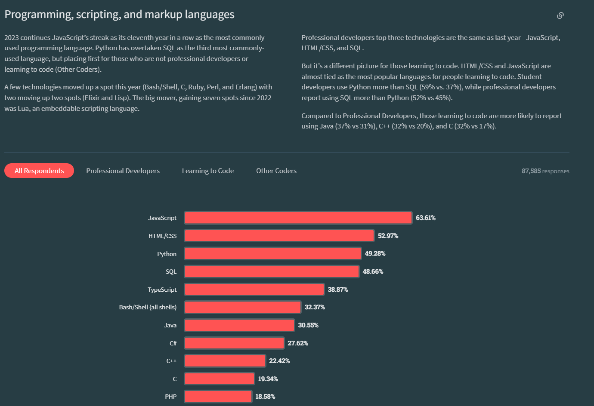

# 100 Saniyede TypeScript

Typescript, Microsoft tarafından geliştirilmiş Javascript'in sözdisimsel bir süper kümesidir.

Yani Typescript yeni bir dil olmayı denemektense Javascript'in üzerine kendi söz dizimini inşa eden ve geliştiricilere kodlarında kullanabilecekleri yeni özellikler sunan bir programlama dilidir.

Typescript, günümüzde Github ve Stackoverflow verilerine göre dünyanın en çok kullanılan 3. programlama dilidir.


Stackoverflow 2023 geliştirici anketine göre %38lik bir oranla geliştiriciler tarafından en çok kullanılan 5. programlama dili olmuştur.



## Tipler

Typescript'in özelliklerinden en önemlisi type sistemi yani tiplerdir. Javascript weakly typed yani zayıf yazılan bir dil olduğu için strongly typed dillere nazaran geliştiricilerin kodlarındaki değişken ve benzeri elementlerin tiplerini belirtme gereksinimini kaldırmıştır

Dilerseniz birkaç örneğe göz atalım.
Tek bir argüman alıp o argümanın karekökünü dönen bir fonksiyon oluşturmak istiyorum

```javascript
function kareKök(n) {
  return Math.sqrt(n);
}
```

Bu kod gayet normal gözüksede çok büyük bir problemi var. Fonksiyonun aldığı argümanın ve döndüğü sonucun tipini bilmiyoruz. Örneğin bu fonksiyonu çağırırken bir sayı yerine bir string gönderirsek Javascript, kodun bu parçası çalışana kadar bize bir hata vermeyecektir.

```javascript
function kareKök(n) {
  return Math.sqrt(n);
}

let sonuç = kareKök("selam");
console.log(sonuç); // NaN
```

Fakat bir hata almasak bile kodu çalıştırdığımızda ve kodun bu kısmına geldiğimizde sonuçtan dönüt olarak NaN yani Not a Number değerini alacağız. Yani Javascript, çok olası bir hatayı, zayıf yazılan bir dil olduğu için farkedemedi.

Şimdi aynı şeyi Typescript ile deneyelim ve
bu sefer argümanlarımızın ve döndüğümüz değerin tipini belirtelim.

```typescript
function kareKök(n: number): number {
  return Math.sqrt(n);
}

let sonuç = kareKök("selam"); // Hata
console.log(sonuç);
```

```
Argument of type 'string' is not assignable to parameter of type 'number'
```

Gördüğünüz üzere yazdığımız kod bize henüz çalıştırmasak bile hiçbir hata verecektir.

## Interfaceler

Typescript ile birlikte gelen bir diğer özellik ise interfacelerdir. Nasıl argümanlara ve değişkenlere tipler ekleyebiliyorsak interfaceler sayesinde objelerin de tiplerini belirleyebiliyoruz.

Bu özellik Rust, Go ve C gibi dillerde de bulabilecceğiniz Struct'lara benzetilebilir.

Yeni bir interface yani Arayüz oluşturmak için interface kelimesini kullanın ve ardından arayüzünüzün ismini yazın

Ardından her bir özelliğin tipini belirtin.

```typescript
interface IUser {
  isim: string;
  yas: number;
  email: string;
}
```

Arayüzümüzü kullanarak bir obje oluşturmak istediğimizde normal bir obje oluşturup objeye arayüzümüzün tipini ekleyebiliriz.

```javascript
let user = {
  isim: "fuekihigh",
  yas: 49,
  email: "vilez@gmail.com",
};
```

⏬⏬⏬⏬⏬⏬⏬⏬⏬⏬

```typescript
let user: IUser = {
  isim: "fuekihigh",
  yas: 49,
  email: "vilez@gmail.com",
};
```

Bu ve bundan sonraki bütün videolarımın metinlerini, kaynakçalarını ve kod örneklerini githubda açık kaynak lisanslı bir projenin dahilinde bulabilirsiniz.

İzlediğiniz için teşekkürler, görüşmek üzere.

# Kaynakça

İstatistikler:

- [Stackoverflow Developer Survey 2023](https://survey.stackoverflow.co/2023/#most-popular-technologies-language)
- [Languish \(Github + Stackoverflow\)](https://tjpalmer.github.io/languish/)

Dil bilgisi:

- [Typescript Handbook](https://www.typescriptlang.org/docs/handbook/intro.html)
- [Typescript - w3Schools](https://www.w3schools.com/typescript/typescript_intro.php)

Special thanks to [Fireship](https://www.youtube.com/@Fireship) as always.